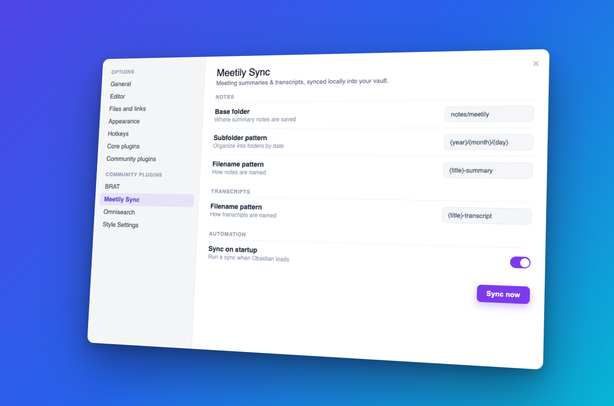

# Meetily Sync

Sync your [Meetily](https://meetily.ai) meeting summaries and transcripts into [Obsidian](https://obsidian.md) as clean, linked Markdown. Fully on-device: no cloud service, no API keys, no meeting bots.

  



## Getting started

Meetily Sync connects two tools you run locally. Set them up in this order.

### 1. Meetily — record and transcribe meetings on-device

[Meetily](https://meetily.ai) is a free, open-source meeting assistant that captures your system audio, transcribes it locally (Whisper / Parakeet), and generates an AI summary. Audio never leaves your computer.

1. Install Meetily for macOS or Windows from [meetily.ai](https://meetily.ai).
2. Grant microphone and system-audio permissions so it can hear everyone on the call, not just you.
3. Record a meeting and let Meetily generate its summary. Meetings are saved to a local database on your machine.
4. Optional: turn on speaker diarization in Meetily's transcription settings so transcripts carry named speakers.

### 2. Obsidian — where your notes live

Install [Obsidian](https://obsidian.md) and open the vault you want your meeting notes to land in.

### 3. Meetily Sync — this plugin

Install it (see [Install](#install)), choose a folder, and click **Sync now**.

## What it solves

Meetily records and summarizes your meetings locally, but that content stays inside the Meetily app. Moving it into your notes means copy-pasting, and nothing ties it back to the rest of your knowledge base.

Meetily Sync closes that gap. It reads Meetily's local database directly and writes every meeting into your vault as Markdown — a summary note and a transcript note per meeting, organized by date and cross-linked. Your meetings become first-class notes you can search, link, tag, and build on, and they never leave your machine.

## What it writes

With the default settings, each meeting produces two notes:

```
notes/meetily/2026/08/18/Weekly Team Sync-summary.md
notes/meetily/2026/08/18/Weekly Team Sync-transcript.md
```

- **Summary note** — the AI summary Meetily generated (decisions, action items, key points).
- **Transcript note** — the full transcript as speaker blocks.
- Both carry YAML frontmatter (`meetily_id`, `title`, `created`/`updated`, `source: meetily`) and link to each other, so they behave like a connected pair in your graph.

Syncing is **idempotent**: meetings you have already exported are skipped, so you can sync as often as you like.

## Install

**From Obsidian (recommended):** open **Settings → Community plugins → Browse**, search for **Meetily Sync**, install, and enable it.

**Manually from a release:**

1. Download `main.js`, `manifest.json`, and `styles.css` from the [latest release](../../releases/latest).
2. Copy all three into `<your vault>/.obsidian/plugins/meetily-sync/`.
3. In Obsidian, open **Settings → Community plugins → Reload**, then enable **Meetily Sync**.

## Usage

- Click the sync ribbon icon (circular arrows), or
- Run the command **Meetily Sync: Sync Meetily meetings now**, or
- Open the plugin settings and press **Sync now**.

New meetings are written to your output folder. Enable **Sync on startup** or **Auto-sync on a timer** in settings to keep it hands-off.

## Settings

Note locations are built from a **base folder** + **subfolder pattern** + **filename pattern**, so you can put notes wherever you like. Summaries and transcripts can share a folder or live in separate ones.

**Notes** and **Transcripts** each have:

| Setting | Notes default | Transcripts default |
| --- | --- | --- |
| Base folder | `notes/meetily` | `notes/meetily` |
| Subfolder pattern | `{year}/{month}/{day}` | `{year}/{month}/{day}` |
| Filename pattern | `{title}-summary` | `{title}-transcript` |

Pattern variables: `{title}`, `{date}`, `{time}`, `{year}`, `{month}`, `{day}`, `{quarter}`. Leave a subfolder pattern blank for a flat folder.

**Content:** export summary / export transcript / include frontmatter / default speaker label / overwrite existing.

**Automation:** sync on startup / auto-sync on a timer + interval / **Sync now** button.

**Advanced → Meetily database location:** the path to Meetily's `meeting_minutes.sqlite`. This is **auto-detected** for your operating system — leave it blank unless you installed Meetily in a custom location:

- **macOS** `~/Library/Application Support/com.meetily.ai/meeting_minutes.sqlite`
- **Windows** `%APPDATA%\com.meetily.ai\meeting_minutes.sqlite`
- **Linux** `~/.config/com.meetily.ai/meeting_minutes.sqlite`

## How it works

The plugin opens Meetily's SQLite database with [sql.js](https://github.com/sql-js/sql.js) (SQLite compiled to WebAssembly), so there are no native modules to build or trust. The WebAssembly binary is embedded in the plugin, so there is nothing extra to place on disk. It loads the database as an **in-memory snapshot** — Meetily's file is only ever read, never modified — and maps the `meetings`, `transcripts`, and `summary_processes` tables into Markdown.

Meetily runs its database in WAL (write-ahead log) mode, which means a meeting can be committed to a side file before it is folded into the main database. Meetily Sync merges those committed pages when it reads, so a meeting you recorded moments ago appears right away, even while Meetily is still open.

## Filesystem and network use

Meetily Sync is transparent about what it touches:

- **Network:** none. The plugin makes no network requests — no API calls, telemetry, analytics, or third-party services. It has no network code paths at all.
- **Files read outside the vault (read-only):** exactly two — Meetily's `meeting_minutes.sqlite` and its `-wal` sidecar (see paths under [Settings](#settings)). They are read via Node's `fs` and **never written, deleted, or modified**. You can override the location in **Advanced → Meetily database location**.
- **Files written:** only Markdown notes inside your vault, in the folders you configure, through Obsidian's Vault API.
- **Background activity:** none unless you opt in. **Sync on startup** runs one sync after Obsidian loads; **Auto-sync on a timer** uses `setInterval` at the interval you choose. Both are off by default and can be turned off at any time.

Because it reads a local file, the plugin is marked `isDesktopOnly` and does not run on mobile.

## Limitations

- **Desktop only.** It reads a local file, so it does not run on Obsidian mobile.
- **Speaker labels.** Meetily only fills in speaker names when diarization is enabled. Without it, transcript lines use the default label; turn on diarization in Meetily and future syncs carry real speakers.

## Packaging (install into your own vault)

To install a build by hand:

1. `npm run build` — produces `main.js` (with the SQLite WebAssembly embedded).
2. Create `<vault>/.obsidian/plugins/meetily-sync/`.
3. Copy in `main.js`, `manifest.json`, and `styles.css`.
4. In Obsidian: **Settings → Community plugins → Reload**, then enable **Meetily Sync**.

```bash
DEST="/path/to/YourVault/.obsidian/plugins/meetily-sync"
mkdir -p "$DEST"
cp main.js manifest.json styles.css "$DEST"/
```

## Releasing

Releases are automated by [`.github/workflows/release.yml`](.github/workflows/release.yml): pushing a tag builds the plugin, attaches `main.js`, `manifest.json`, and `styles.css` to a GitHub Release, and records build-provenance attestations for those assets.

```bash
npm version patch        # bumps manifest.json + versions.json
git push && git push --tags
```

The tag must equal the version in `manifest.json` (no `v` prefix), which `npm version` guarantees.

## Publishing to the Obsidian community store

Meetily Sync is listed in the Obsidian community store. New plugins are submitted through the plugin portal at [community.obsidian.md](https://community.obsidian.md) (sign in, link the GitHub account, and add the repository); the older pull-request flow against `obsidian-releases` has been retired. Once a plugin is listed, every later GitHub Release is picked up automatically, and Obsidian runs an automated scorecard scan on each release.

## Development

```bash
npm install      # installs deps and fetches sql.js
npm run dev       # watch build -> main.js (+ copies sql-wasm.wasm)
npm run lint      # eslint-plugin-obsidianmd rules
npm test          # jest unit tests
npm run build     # lint + type-check + production bundle
```

For live testing, symlink the repo into a scratch vault and reload Obsidian after each build:

```bash
ln -s "$(pwd)" "/path/to/TestVault/.obsidian/plugins/meetily-sync"
```

See [CONTRIBUTING.md](CONTRIBUTING.md) for more.

## Support

If Meetily Sync saves you time, you can support development here:

<a href="https://buymeacoffee.com/m_sahil"></a>

## License

[MIT](LICENSE)
